# 🏢 Listed Companies Intelligence Pipeline — USA

> An end-to-end automated data engineering pipeline that collects, enriches, and stores structured business intelligence on publicly listed US companies — including key executives, LinkedIn profiles, validated email addresses, sector classifications, and financial metadata.

---

## 📌 Table of Contents

- [Project Overview](#project-overview)
- [Pipeline Architecture](#pipeline-architecture)
- [Data Flow](#data-flow)
- [How Company Data Is Extracted](#how-company-data-is-extracted)
- [How Key People Are Extracted](#how-key-people-are-extracted)
- [How LinkedIn Profiles Are Found](#how-linkedin-profiles-are-found)
- [How Emails Are Discovered & Validated](#how-emails-are-discovered--validated)
- [Database Schema](#database-schema)
- [Script Reference](#script-reference)
- [Setup & Installation](#setup--installation)
- [Configuration](#configuration)
- [Running the Pipeline](#running-the-pipeline)
- [Email Rating System](#email-rating-system)
- [Rate Limiting & Anti-Bot Strategy](#rate-limiting--anti-bot-strategy)
- [Resuming Interrupted Runs](#resuming-interrupted-runs)
- [Dependencies](#dependencies)
- [Known Issues & Limitations](#known-issues--limitations)
- [License](#license)

---

## Project Overview

This pipeline automates the collection of actionable business intelligence on publicly listed US companies. It is designed to run sequentially, with each script feeding into the next, ultimately producing a contact-ready database of company executives complete with LinkedIn profiles and validated email addresses.

**What it collects:**
- Company HQ location, sector, industry, and revenue
- Company website URLs
- Key executive names and designations (CEO, CFO, etc.)
- LinkedIn profile URLs per executive
- Best-guess email addresses with confidence ratings
- Sector and category classifications from companiesmarketcap.com

---

## Pipeline Architecture

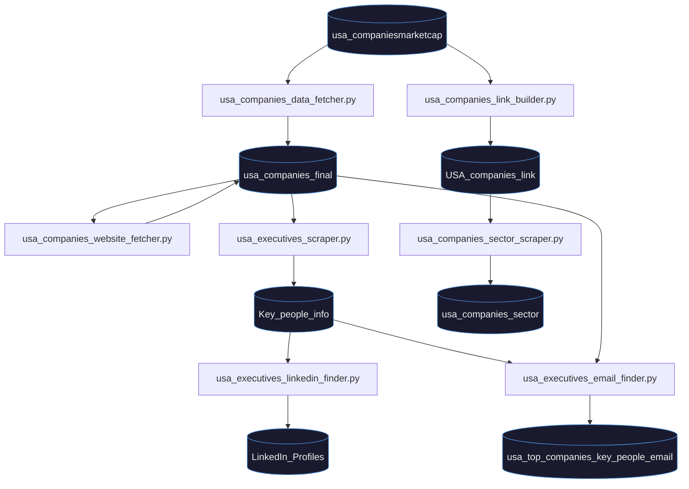

---

## Data Flow

### Main Pipeline — Executives to Emails

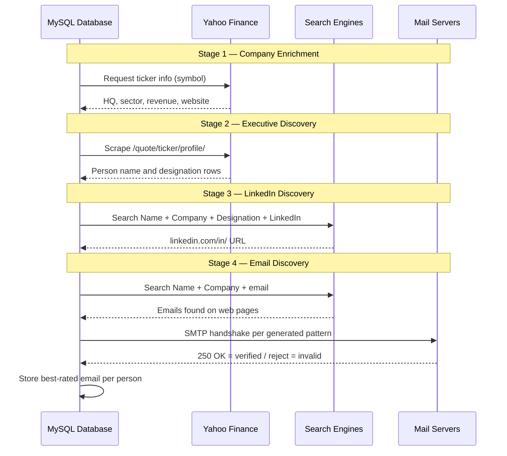

### Sector Pipeline — Independent Branch

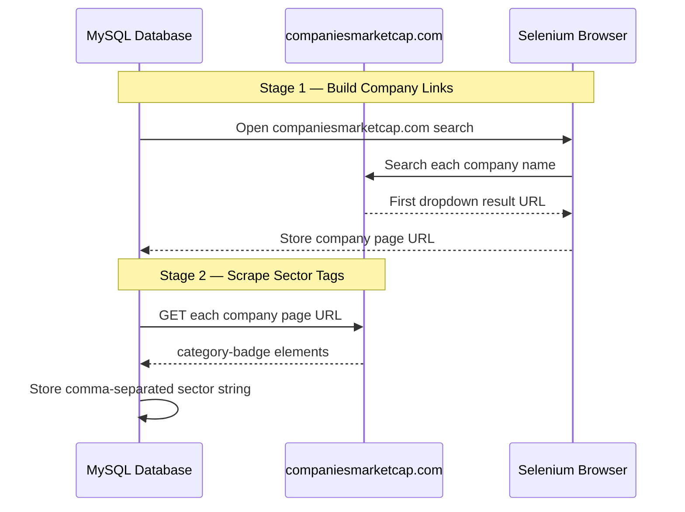

---

## How Company Data Is Extracted

This is the first and most foundational step of the pipeline. Before any executive or contact data can be gathered, the pipeline must build a clean, enriched record for each company. This happens across two scripts: `usa_companies_data_fetcher.py` and `usa_companies_website_fetcher.py`.

### Step 1 — Reading the Source Table

The pipeline starts with `usa_companiesmarketcap`, a pre-populated table containing only two things per company: its **name** and its **stock ticker symbol** (e.g. `AAPL`, `MSFT`, `TSLA`). Every other piece of data is derived from this.

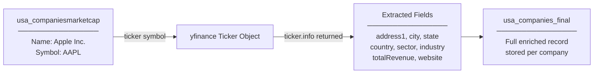

### Step 2 — Calling Yahoo Finance via yfinance

For each row in `usa_companiesmarketcap`, the script instantiates a `yfinance.Ticker` object and calls `.info`. This returns a large Python dictionary containing dozens of fields about the company. Only the fields relevant to the pipeline are extracted.

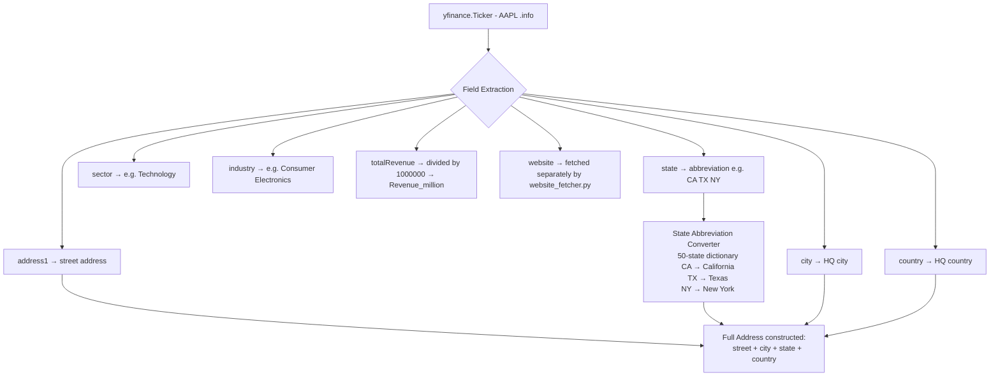

### Step 3 — State Abbreviation Conversion

Yahoo Finance returns US states as two-letter abbreviations (`CA`, `TX`, `NY`). The script contains a hardcoded 50-state dictionary that converts every abbreviation to its full name before storing. If an unrecognized abbreviation is encountered, the original abbreviation is stored as-is rather than failing.

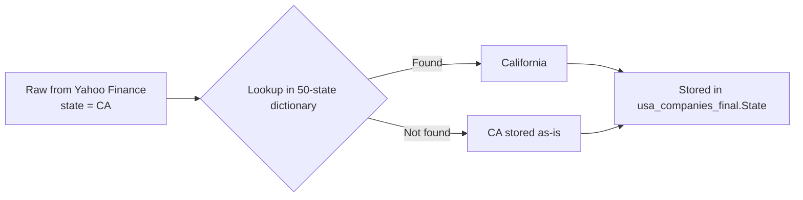

### Step 4 — Website Fetching (Separate Pass)

Website URLs are fetched in a dedicated second script (`usa_companies_website_fetcher.py`) rather than in the same pass as the other fields. This is because Yahoo Finance rate-limits API calls, and separating the website fetch into its own script with its own backoff logic allows the pipeline to be more resilient. The script only processes rows where `Company_Website IS NULL`, so it is safe to re-run multiple times without overwriting existing data.

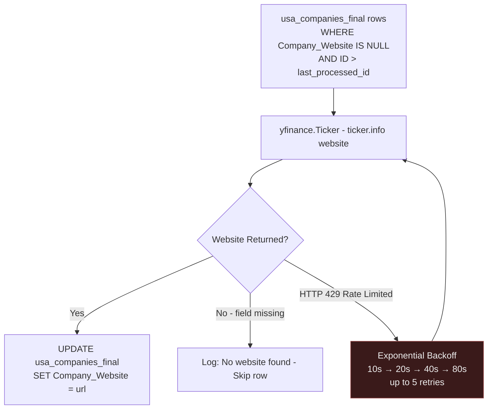

### What a Completed Company Record Looks Like

After both scripts complete, a single company entry in `usa_companies_final` looks like this:

| Field | Example Value |
|-------|--------------|
| Name | Apple Inc. |
| Symbol | AAPL |
| City | Cupertino |
| State | California |
| Full_Address | One Apple Park Way, Cupertino, California, United States |
| Country | United States |
| Sector | Technology |
| Industry | Consumer Electronics |
| Revenue_million | 385,706.00 |
| Company_Website | https://www.apple.com |

---

## How Key People Are Extracted

Once the company records are enriched, the pipeline moves to discovering who the key executives are at each company. This is handled by `usa_executives_scraper.py`, which scrapes Yahoo Finance's company profile pages.

### Overview of the Scraping Process

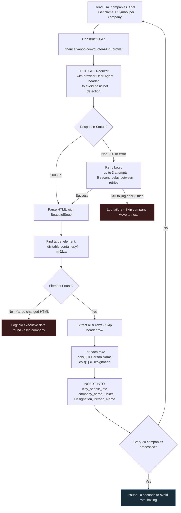

### How the Yahoo Finance Profile Page Is Parsed

Yahoo Finance's company profile page contains an executive table in HTML. The script uses BeautifulSoup to locate this table and walk through its rows. The page structure being targeted looks like this:

```
<div class="table-container yf-mj92za">
  <table>
    <thead>
      <tr> [header — skipped] </tr>
    </thead>
    <tbody>
      <tr>
        <td>Tim Cook</td>            ← cols[0] = Person Name
        <td>CEO & Director</td>      ← cols[1] = Designation
        <td>1960</td>                ← cols[2] = Year Born (not stored)
        <td>...</td>                 ← other cols (not stored)
      </tr>
      <tr>
        <td>Luca Maestri</td>
        <td>CFO & Senior VP</td>
        ...
      </tr>
    </tbody>
  </table>
</div>
```

The script skips the first row (header), then reads `cols[0]` and `cols[1]` from every subsequent row, inserting one database record per executive found.

### What Multiple Executives from One Company Look Like

A single company like Apple may produce multiple rows in `Key_people_info`:

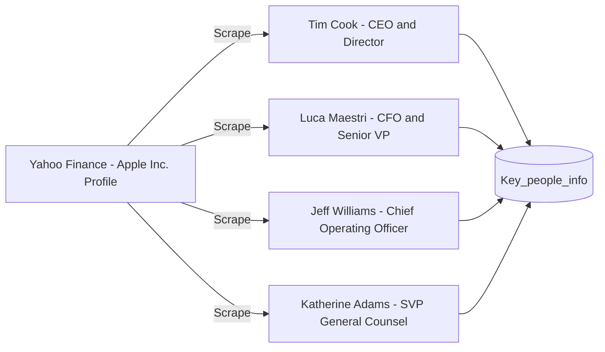

### Retry Logic in Detail

The scraper is designed to be resilient to transient network issues. If a request fails for any reason, it retries up to 3 times with a 5-second gap between each attempt before giving up and moving on.

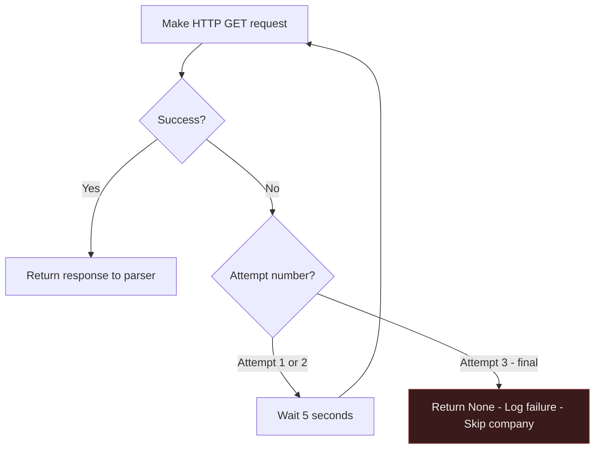

---

## How LinkedIn Profiles Are Found

After executives are stored in `Key_people_info`, the next stage uses `usa_executives_linkedin_finder.py` to find a LinkedIn profile URL for each person. This is the most complex script in the pipeline — it uses a real browser, rotates user agents, searches multiple search engines, and includes sophisticated anti-detection measures.

### Why a Real Browser Is Used

A standard HTTP request to Google or Bing to search for LinkedIn profiles would be immediately blocked by bot detection. The script uses `undetected_chromedriver`, which is a modified version of Selenium's ChromeDriver that patches the browser to remove all signals that identify it as an automated tool. This makes the browser appear indistinguishable from a real user browsing the web.

### Full LinkedIn Discovery Flow

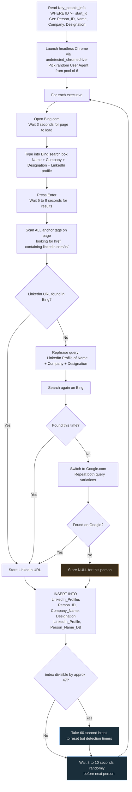

### Search Engine Strategy — Why Bing First

The script tries Bing before Google for a deliberate reason: Bing is significantly more lenient with automated searches and less likely to present CAPTCHAs or rate-limit the IP. Google is kept as the fallback because it tends to index LinkedIn more thoroughly, so if Bing misses a profile, Google often finds it.

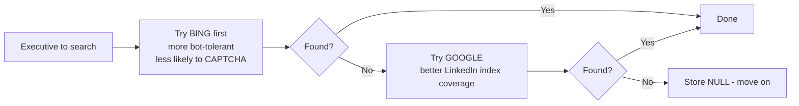

### How LinkedIn URLs Are Identified on Results Pages

Once a search results page loads, the script does not try to parse the page structure with CSS selectors or XPath — instead, it collects **every single anchor tag** on the entire page and filters for any `href` attribute that contains the string `linkedin.com/in/`. This approach is resilient to changes in search engine page layouts because it doesn't depend on any specific HTML structure around the result links.

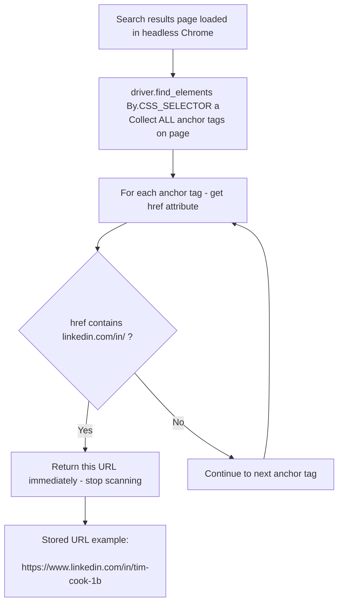

### User Agent Rotation

Every time the Chrome browser is launched (once per full script run), a user agent is selected at random from a pool of 6. This prevents repeated requests all looking identical from a server fingerprinting perspective.

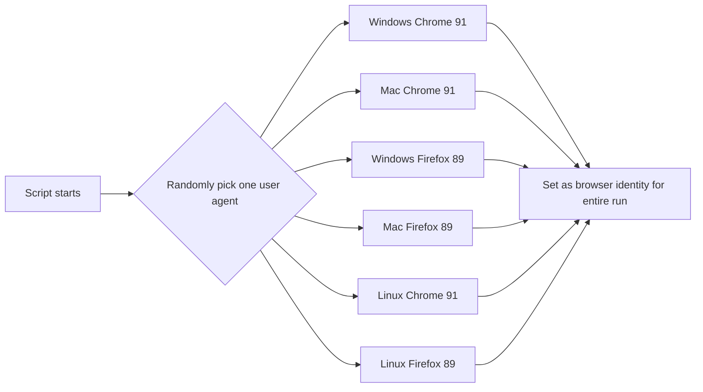

### Anti-Detection Timing Strategy

The script uses randomized delays and periodic long pauses to mimic human browsing behavior. A perfectly consistent delay (e.g. exactly 5 seconds every time) is itself a bot signal. Randomization makes the pattern appear human.

```mermaid
gantt
    title Timing Pattern for 50 Consecutive Executive Searches
    dateFormat X
    axisFormat %ss

    section Searches 1 to 47
    Search and extract result     :0, 3
    Random wait 8 to 10s         :3, 13
    Search and extract result     :13, 16
    Random wait 8 to 10s         :16, 26

    section Break at search 47
    60-second cooldown break      :26, 86

    section Searches 48 to 50
    Search and extract result     :86, 89
    Random wait 8 to 10s         :89, 99
```

### What Gets Stored

Each row in `LinkedIn_Profiles` contains:

| Field | Example Value |
|-------|--------------|
| Person_ID | 142 (FK to Key_people_info.ID) |
| Company_Name | Apple Inc. |
| Designation | CEO & Director |
| LinkedIn_Profile | https://www.linkedin.com/in/tim-cook-1b |
| Person_Name_DB | Tim Cook |

If no LinkedIn profile is found after exhausting all search attempts, `LinkedIn_Profile` is stored as `NULL` — the row is still inserted so the pipeline knows this person was processed and does not attempt it again on reruns.

---

## How Emails Are Discovered & Validated

`usa_executives_email_finder.py` combines three techniques to find the best possible email address for each executive: pattern generation from the company domain, Google search scraping, and SMTP verification.

### Full Email Discovery Flow

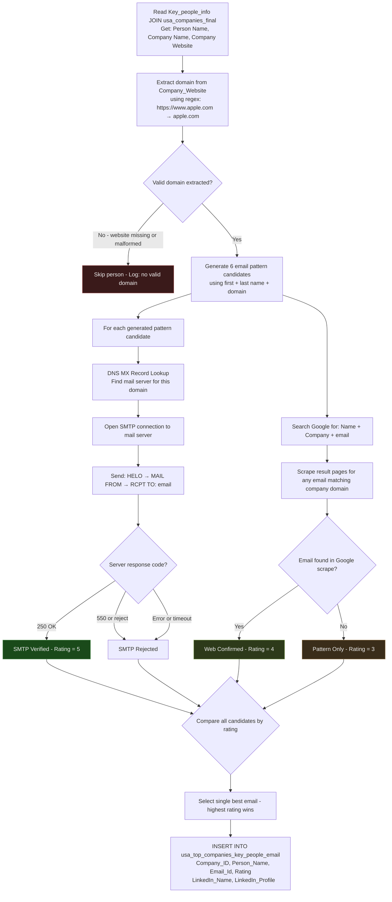

### The 6 Email Patterns Generated

For a person named **John Smith** at domain **apple.com**, the script generates:

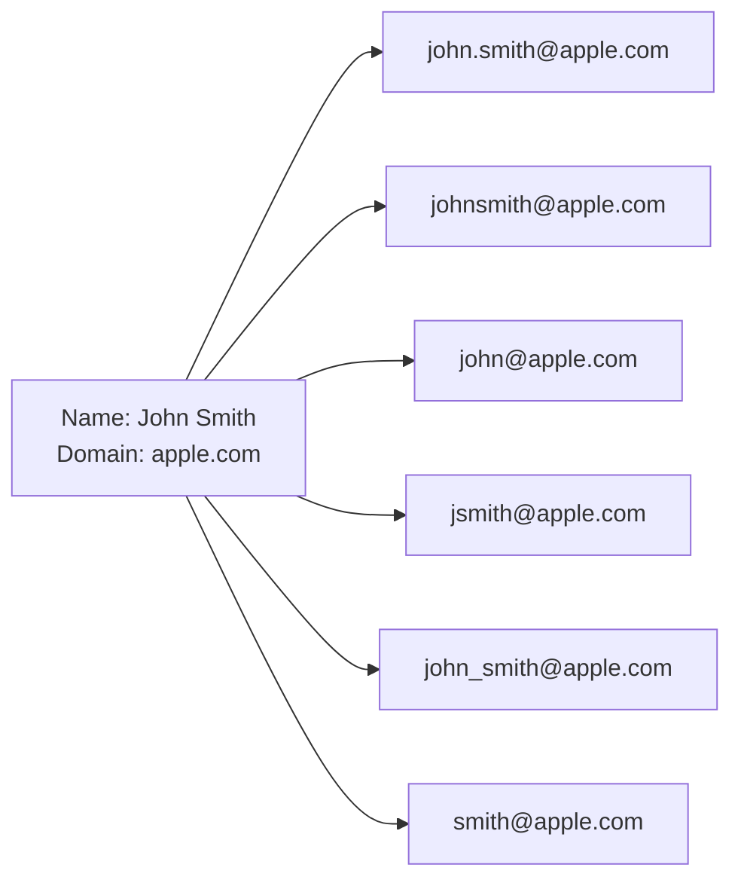

All 6 are generated simultaneously and each goes through the SMTP check independently. The highest-rated one is stored.

### How SMTP Verification Works

SMTP verification exploits the fact that mail servers must respond to email delivery requests. The script mimics being a mail server trying to deliver a message, and checks whether the target server accepts or rejects the address — without ever actually sending an email.

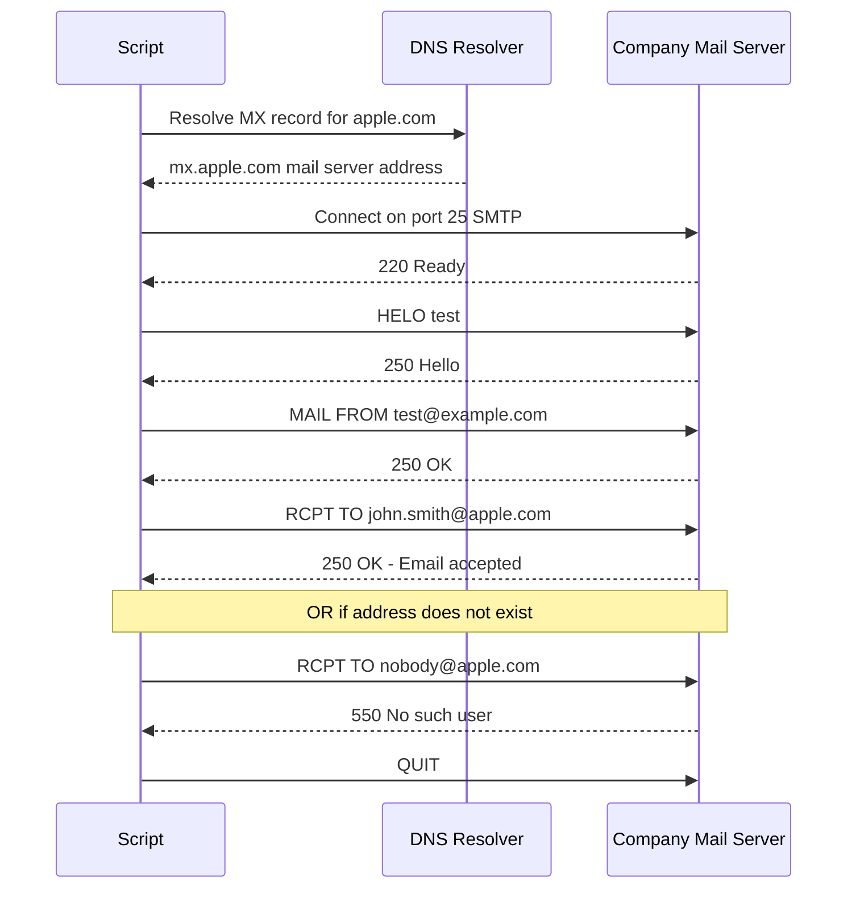

---

## Database Schema

### Entity Relationship Diagram

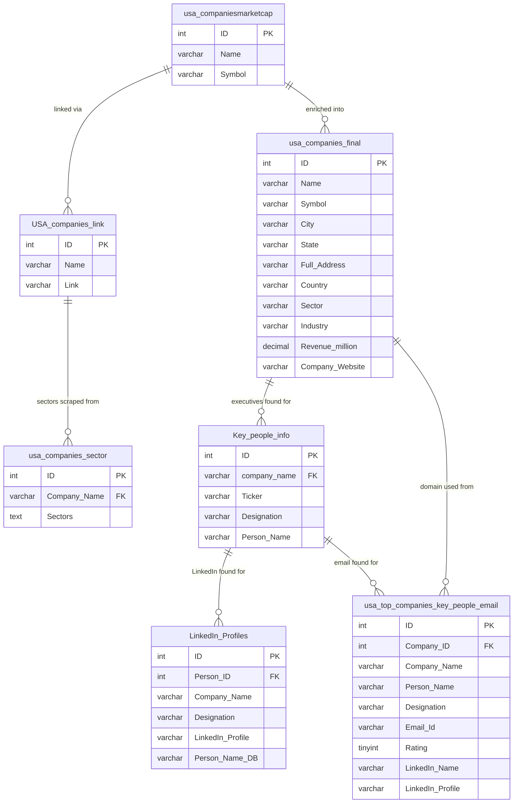

### Table Descriptions

| Table | Populated By | Purpose |
|-------|-------------|---------|
| `usa_companiesmarketcap` | Manual / external import | Master company list — seed for the entire pipeline |
| `usa_companies_final` | `usa_companies_data_fetcher.py` | Enriched company records with HQ, financials, and website |
| `USA_companies_link` | `usa_companies_link_builder.py` | Company page URLs on companiesmarketcap.com |
| `usa_companies_sector` | `usa_companies_sector_scraper.py` | Sector and category tags per company |
| `Key_people_info` | `usa_executives_scraper.py` | Executive names and designations from Yahoo Finance |
| `LinkedIn_Profiles` | `usa_executives_linkedin_finder.py` | LinkedIn profile URLs matched to executives |
| `usa_top_companies_key_people_email` | `usa_executives_email_finder.py` | Best email per executive with confidence rating |

---

## Script Reference

### `usa_companies_data_fetcher.py`

**Purpose:** Seeds the `usa_companies_final` table with company financial and location data.

**How it works:**
```
For each company in usa_companiesmarketcap:
    → Call yfinance ticker.info
    → Extract: address, city, state, country, sector, industry, revenue
    → Convert state abbreviation to full name (e.g. CA → California)
    → Insert into usa_companies_final
```

Contains a full 50-state abbreviation-to-name mapping dictionary. Falls back gracefully if any field is missing from the Yahoo Finance response.

---

### `usa_companies_website_fetcher.py`

**Purpose:** Fills the `Company_Website` column for rows where it is NULL.

**How it works:**
```
For each company WHERE Company_Website IS NULL AND ID > last_processed_id:
    → Call yfinance ticker.info["website"]
    → On HTTP 429 (rate limit): exponential backoff (10s → 20s → 40s → ...)
    → Update Company_Website column
```

**Resume variable:** `last_processed_id` at the bottom of the script.

---

### `usa_executives_scraper.py`

**Purpose:** Scrapes executive names and designations from Yahoo Finance profile pages.

**How it works:**
```
For each company in usa_companies_final:
    → GET https://finance.yahoo.com/quote/{ticker}/profile/
    → Parse div.table-container.yf-mj92za with BeautifulSoup
    → Extract each row: cols[0] = Person Name, cols[1] = Designation
    → Insert into Key_people_info
    → Retry up to 3 times on failure
    → Pause 10 seconds every 20 companies
```

> ⚠️ Yahoo Finance changes its CSS class names periodically. If scraping stops working, inspect the current profile page HTML and update the `class_` selector.

---

### `usa_executives_linkedin_finder.py`

**Purpose:** Finds LinkedIn profile URLs for each executive using automated browser searches.

**How it works:**
```
For each executive in Key_people_info WHERE ID >= start_id:
    → Open Bing, search: "{Name} {Company} {Designation} LinkedIn profile"
    → Scan all <a> tags for linkedin.com/in/ URLs
    → If not found, try Google with same query
    → If still not found, try alternate query format
    → Insert LinkedIn URL (or NULL) into LinkedIn_Profiles
    → Wait 8–10 seconds between people
    → Take 60-second break every ~47 searches
```

Uses `undetected_chromedriver` to avoid bot detection. Rotates through 6 user agent strings.

**Resume variable:** `start_id` at the bottom of the script.

---

### `usa_executives_email_finder.py`

**Purpose:** Generates, validates, and scores email address candidates for each executive.

**Email patterns generated per person:**
```
firstname.lastname@domain.com
firstnamelastname@domain.com
firstname@domain.com
flastname@domain.com
firstname_lastname@domain.com
lastname@domain.com
```

Each candidate is checked via SMTP and Google search, then rated. The highest-rated email is stored. See the [Email Rating System](#email-rating-system) section for full details.

---

### `usa_companies_link_builder.py`

**Purpose:** Builds the `USA_companies_link` table by finding each company's page on companiesmarketcap.com.

**How it works:**
```
For each company in usa_companiesmarketcap (after specific_company resume point):
    → Open companiesmarketcap.com in headless Chrome
    → Type company name into search bar
    → Capture first dropdown result name + URL
    → Insert into USA_companies_link
```

**Resume variable:** `specific_company` string — script skips all companies up to and including this name.

---

### `usa_companies_sector_scraper.py`

**Purpose:** Scrapes sector and category tags for each company from companiesmarketcap.com.

**How it works:**
```
For each company in USA_companies_link (after resume point):
    → GET the stored company page URL
    → Parse div.info-box.categories-box .category-badge elements
    → Strip emojis and non-alphanumeric characters
    → Join sectors with comma separator
    → Insert into usa_companies_sector if not already present
    → Sleep 2 seconds between requests
```

---

## Setup & Installation

### Prerequisites

- Python 3.9+
- MySQL 8.0+
- Google Chrome (required for `usa_executives_linkedin_finder.py` and `usa_companies_link_builder.py`)
- MySQL database named `usa` pre-created

### 1. Clone the Repository

```bash
git clone https://github.com/YOUR_USERNAME/listed-companies-intelligence.git
cd listed-companies-intelligence
```

### 2. Install Python Dependencies

```bash
pip install -r requirements.txt
```

### 3. Set Up the Database

```bash
mysql -u root -p < sql/usa_schema.sql
```

### 4. Configure Credentials

```bash
cp config/db_config.example.py config/db_config.py
```

Edit `config/db_config.py`:

```python
USA_DB = {
    "host": "localhost",
    "user": "root",
    "password": "YOUR_PASSWORD",
    "database": "usa"
}
```

> `config/db_config.py` is listed in `.gitignore` and must never be committed.

### 5. Seed the Source Table

Populate `usa_companiesmarketcap` with your company list (Name + Symbol columns) before running any scripts. This is the single entry point for the entire pipeline.

---

## Configuration

### Resume Points

All long-running scripts support resuming from an exact stopping point:

| Script | Variable | Type | Description |
|--------|----------|------|-------------|
| `usa_companies_website_fetcher.py` | `last_processed_id` | `int` | MySQL row ID — resumes from next ID |
| `usa_executives_linkedin_finder.py` | `start_id` | `int` | `Key_people_info` ID — resumes from this ID |
| `usa_companies_sector_scraper.py` | `specific_company` | `str` | Company name — resumes after this entry |
| `usa_companies_link_builder.py` | `specific_company` | `str` | Company name — resumes after this entry |

---

## Running the Pipeline

### Full Execution Order

```bash
# ── Stage 1: Company Foundation ─────────────────────────────────
python usa_companies_data_fetcher.py
python usa_companies_website_fetcher.py

# ── Stage 2: Executive Discovery ────────────────────────────────
python usa_executives_scraper.py

# ── Stage 3: LinkedIn + Email Discovery ─────────────────────────
python usa_executives_linkedin_finder.py
python usa_executives_email_finder.py

# ── Stage 4: Sector Pipeline (independent — run any time) ───────
python usa_companies_link_builder.py
python usa_companies_sector_scraper.py
```

### Script Dependency Map

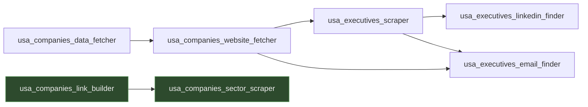

The green branch (sector pipeline) is fully independent and can run in parallel with the main pipeline.

---

## Email Rating System

```mermaid
flowchart TD
    A[Email Candidate] --> B{SMTP MX Handshake Returns 250?}
    B -->|Yes| C[Rating 5 — SMTP Verified]
    B -->|No| D{Found on Web via Google Search?}
    D -->|Yes| E[Rating 4 — Web Confirmed]
    D -->|No| F[Rating 3 — Pattern Generated]

    style C fill:#1a4a1a,color:#eee,stroke:#5a9a5a
    style E fill:#2d3a1a,color:#eee,stroke:#7a9a4a
    style F fill:#3a2d1a,color:#eee,stroke:#9a7a4a
```

| Rating | Meaning | Reliability |
|--------|---------|-------------|
| 5 | SMTP server returned 250 OK during handshake | High — server accepted the address |
| 4 | Email address found on a public web page via Google | Medium — was published somewhere online |
| 3 | Pattern-generated from name + domain, unconfirmed | Low — best guess based on naming convention |

> **Note:** Some mail servers return 250 for all addresses regardless of validity (catch-all configuration). Rating 5 means likely valid, not guaranteed deliverable.

---

## Rate Limiting & Anti-Bot Strategy

Each script implements throttling to avoid IP bans and API rate limits:

| Script | Per-Request Delay | Batch Pause |
|--------|------------------|-------------|
| `usa_companies_data_fetcher.py` | yfinance handles internally | — |
| `usa_companies_website_fetcher.py` | 1–3s random | Exponential backoff on HTTP 429 |
| `usa_executives_scraper.py` | — | 10s every 20 companies |
| `usa_executives_linkedin_finder.py` | 8–10s per person | 60s every ~47 searches |
| `usa_executives_email_finder.py` | 6–9s between Google queries | — |
| `usa_companies_sector_scraper.py` | 2s per page | — |

---

## Resuming Interrupted Runs

If any script is interrupted, find the last successfully processed record and update the resume variable before restarting.

**For ID-based resume:**
```sql
-- usa_executives_linkedin_finder.py
SELECT MAX(Person_ID) FROM LinkedIn_Profiles;
-- Set start_id to this value + 1

-- usa_companies_website_fetcher.py
SELECT MAX(ID) FROM usa_companies_final WHERE Company_Website IS NOT NULL;
-- Set last_processed_id to this value
```

**For name-based resume:**
```sql
-- usa_companies_sector_scraper.py / usa_companies_link_builder.py
SELECT Company_Name FROM usa_companies_sector ORDER BY ID DESC LIMIT 1;
-- Set specific_company to this value
```

---

## Dependencies

```
mysql-connector-python==8.3.0     # MySQL driver
yfinance==0.2.37                  # Yahoo Finance API wrapper
requests==2.31.0                  # HTTP requests
beautifulsoup4==4.12.3            # HTML parsing
selenium==4.18.1                  # Browser automation
undetected-chromedriver==3.5.5    # Anti-detection Chrome driver
webdriver-manager==4.0.1          # Auto ChromeDriver management
dnspython==2.6.1                  # DNS/MX record lookups for SMTP validation
google==3.0.0                     # Google search wrapper
pandas==2.2.1                     # DataFrame handling
openpyxl==3.1.2                   # Excel export
lxml==5.1.0                       # Fast HTML parser for BeautifulSoup
```

---

## Known Issues & Limitations

**Yahoo Finance CSS Changes**
`usa_executives_scraper.py` targets `div.table-container.yf-mj92za`. Yahoo Finance occasionally renames CSS classes. If the scraper returns no results, inspect the current profile page HTML and update the selector.

**SMTP Catch-All Servers**
Some company mail servers accept all addresses and return 250 OK regardless of whether the mailbox exists. Rating 5 means the server did not reject the address, not that it is guaranteed deliverable.

**LinkedIn Anti-Bot Detection**
`undetected_chromedriver` bypasses most detection at the time of writing, but LinkedIn and Google continuously update their systems. If profiles stop being discovered, check whether pages are returning CAPTCHAs.

**Google Search Rate Limits**
`usa_executives_email_finder.py` makes direct HTTP requests via the `googlesearch` library. Google will temporarily block IPs after too many rapid requests. The built-in 6–9 second delay mitigates this but running from a server with rotating proxies is recommended for large datasets.

---

## License

This project is licensed under the MIT License. See the [LICENSE](LICENSE) file for details.